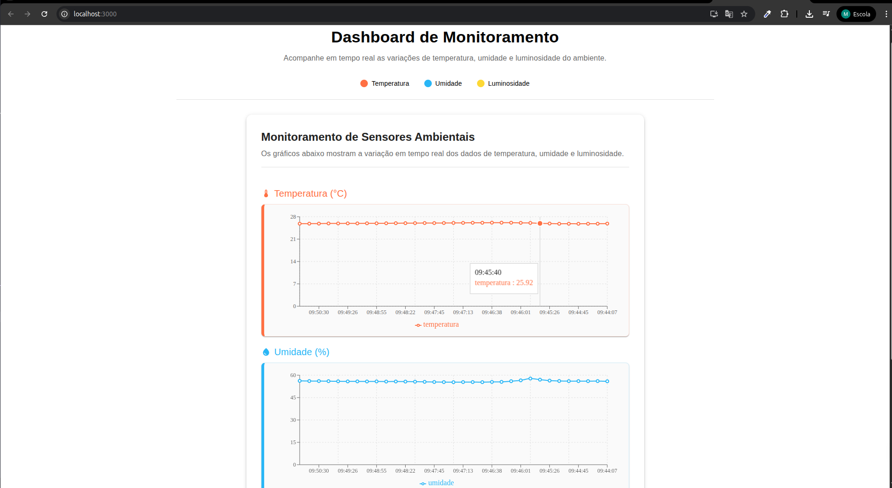

# 🌡️ MonitoringUmTempLuz

Sistema completo de monitoramento ambiental com sensores de **temperatura**, **umidade** e **luminosidade**, integrando hardware com **Raspberry Pi Pico W**, backend em **Node.js** e frontend em **React**. Ideal para aplicações como salas de aula, laboratórios, estufas e ambientes que demandam acompanhamento em tempo real.

---

## 📷 Visão Geral

<!-- Substitua abaixo com uma imagem do sistema ou do dashboard -->


---

## 🧩 Componentes do Projeto

### 🔌 Hardware

- Raspberry Pi Pico W com **firmware PyPico (MicroPython)**
- Sensor AHT10 – temperatura e umidade
- Sensor BH1750 – luminosidade
- Display OLED SSD1306 (opcional, para feedback local)
- Conexão via Wi-Fi para envio dos dados

### 🧠 Backend – API (`/api-sensores`)

- Desenvolvida em **Node.js** + **Express**
- Banco de dados **MongoDB** (local ou em nuvem via MongoDB Atlas)
- Recebe dados dos sensores e os disponibiliza para o frontend
- Rota principal: `POST /api/sensores`

### 🌐 Frontend – Dashboard (`/dashboard-sensores`)

- Aplicação **React** criada com Create React App
- Exibe dados em tempo real com gráficos (ex: Recharts)
- Interface responsiva com **Material UI**
- Consome dados da API e os apresenta de forma visual

---

## 🚀 Como Rodar o Projeto

### 1. Clone o repositório

```bash
git clone https://github.com/LivramentoAmaral/MonitoringUmTempLuz.git
cd MonitoringUmTempLuz
```

### 2. Configurar a API

```bash
cd api-sensores
npm install
cp .env.example .env  # ou crie um .env manualmente
# Edite o .env com a PORT e a string MONGODB_URI
npm run dev
```

> Exemplo de conexão:
> ```bash
> Conectado ao MongoDB
> Servidor rodando na porta 5000
> ```

### 3. Rodar o Frontend

```bash
cd ../dashboard-sensores
npm install
npm start
```

> A aplicação estará disponível em: [http://localhost:3000](http://localhost:3000)

### 4. Executar o Código na Raspberry Pi Pico W

- Acesse a pasta `monitoramento/lib`
- Envie os arquivos para a Pico W com Thonny ou ampy
- O script `main.py` coleta dados e envia via Wi-Fi para a API

---

## 📡 Fluxo de Funcionamento

```text
[Sensores → Raspberry Pi Pico W → Wi-Fi → API Node.js → MongoDB]
                                               ↓
                                         [Dashboard React]
```

---

## 🧪 Exemplo de Payload Enviado

```json
{
  "temperatura": 26.1,
  "umidade": 54.8,
  "luminosidade": 285,
  "data": "2025-07-03T10:15:00Z"
}
```

---

## 🛠️ Tecnologias Utilizadas

- **MicroPython (PyPico)**
- **Node.js**, **Express**, **Mongoose**
- **MongoDB**
- **React.js**, **Material UI**, **Recharts**
- **Thonny** / `ampy` para comunicação com a Pico W

---

## 📁 Estrutura do Projeto

```
MonitoringUmTempLuz/
│
├── api-sensores/           # API REST Node.js + MongoDB
├── dashboard-sensores/     # Frontend React
└── monitoramento/          # Código para Raspberry Pi Pico W (PyPico)
```

---

## 👤 Autor

**Marcos do Livramento Amaral**  
GitHub: [@LivramentoAmaral](https://github.com/LivramentoAmaral)

---

## 📬 Contato

Contribuições são bem-vindas!  


