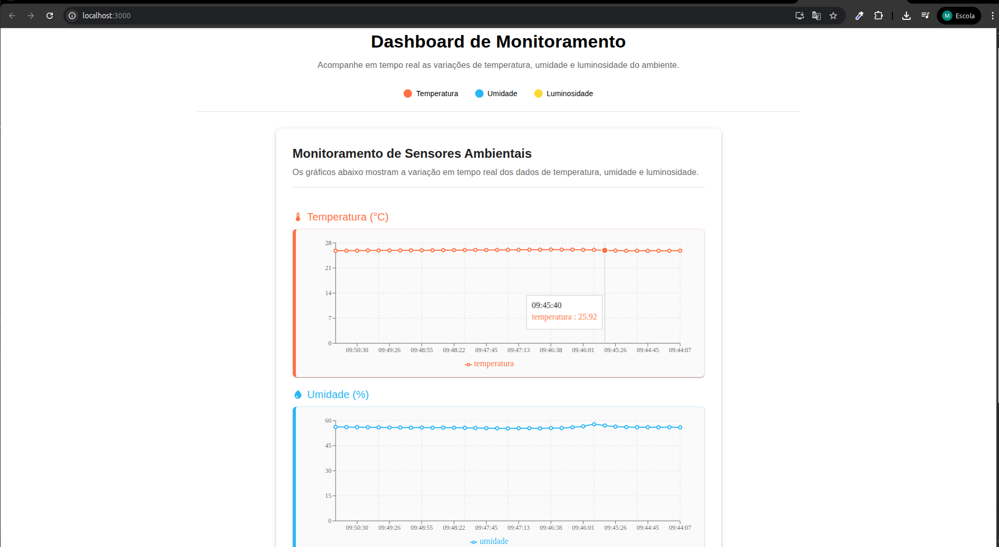

# 🖥️ Dashboard de Sensores

Interface web desenvolvida em React para exibição em tempo real dos dados de **temperatura**, **umidade** e **luminosidade** enviados por sensores via API.

---

## 📸 Preview

<!-- Substitua o caminho abaixo por uma imagem do dashboard -->


---

## ▶️ Como Rodar o Projeto

Siga os passos abaixo para iniciar a aplicação localmente:

### 1. Instale as dependências

```bash
npm install
```

### 2. Inicie o servidor de desenvolvimento

```bash
npm start
```

A aplicação será iniciada em:  
[http://localhost:3000](http://localhost:3000)

A página será recarregada automaticamente a cada alteração no código.

---

## 🌐 Requisitos

- Node.js (versão 14 ou superior)
- Navegador moderno (recomendado: Google Chrome ou Firefox)
- API de sensores rodando em segundo plano (ex: [http://localhost:5000/api/sensores](http://localhost:5000/api/sensores))

---

## 🛠️ Scripts adicionais

```bash
npm run build   # Gera versão otimizada para produção
npm test        # Roda os testes (se configurados)
npm run eject   # Expõe as configs do Create React App (opcional e irreversível)
```

---

## 📁 Estrutura esperada de dados (exemplo JSON)

```json
{
  "temperatura": 25.3,
  "umidade": 58.2,
  "luminosidade": 320,
  "data": "2025-07-03T10:15:00Z"
}
```

---
